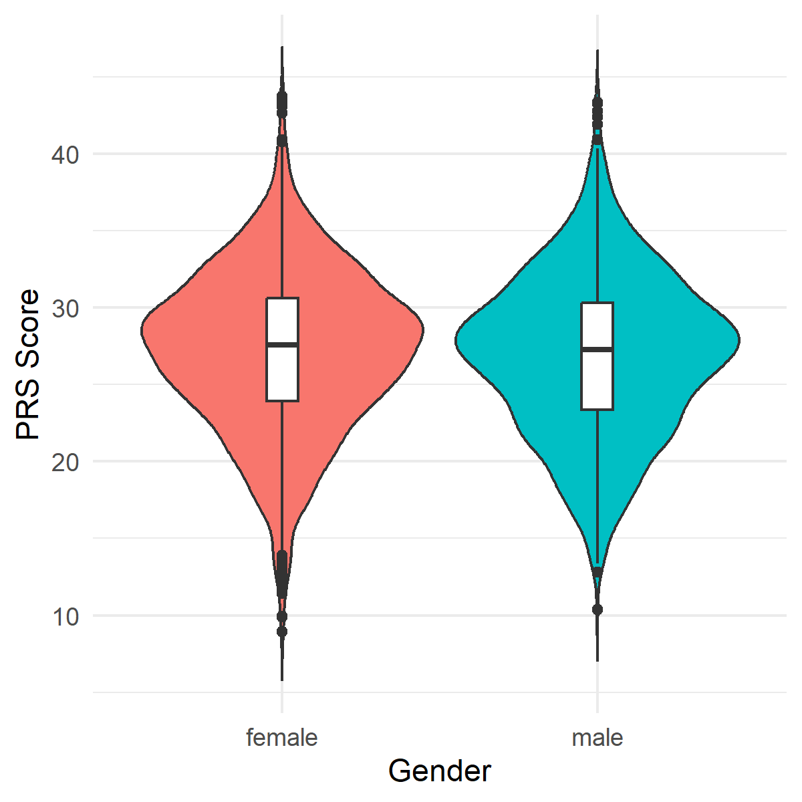

# Polygenic Risk Score (PRS) Pipeline with 1000 Genomes and Asthma GWAS

This project demonstrates calculation of Polygenic Risk Scores (PRS) using the public 1000 Genomes Project genotype data and asthma GWAS summary statistics. The pipeline covers data download, preprocessing, quality control, format conversion, scoring with PLINK, and initial summary.

PRS quantify an individual's genetic predisposition to a trait or disease by summing the effects of thousands to millions of genetic variants, each of which individually has a small effect. The concept is especially relevant in human disease genetics, where inheritance is polygenic and complex environmental factors also contribute.

---

## Table of Contents

- [Starting Notes](#starting-notes)
- [Project Overview](#project-overview)
- [Directory Structure](#directory-structure)
- [Step-by-Step Workflow](#step-by-step-workflow)
- [Output and Interpretation](#output-and-interpretation)
- [Further Notes](#further-notes)
- [References and Resources](#references-and-resources)

---

## Starting Notes
- This project is an **introductory analysis** focused on familiarizing myself with human genomics data and **polygenic risk score (PRS)** methodologies.
- My academic and professional background is in plant genomics and quantitative genetics, including extensive experience with GWAS, genomic prediction, QTL mapping, and RNA-seq analysis in plant systems.
- As my prior expertise is exclusively in plant genetics, this project represents **my first hands-on work with human genomic datasets**.
- The primary goal is to build practical skills in human PRS calculation and data processing, using openly available resources.
- Due to data access restrictions around most human datasets, I am using the 1000 Genomes Project and publicly available asthma GWAS summary statistics.

## Project Overview

This project implements a reproducible pipeline using:

- Genotypes: 1000 Genomes Project phase 3 data, representing diverse human populations.
- Summary statistics: GWAS Catalog asthma GWAS (GCST005212)
- Tools: PLINK 1.9
- Analysis environment: Bash scripts for data processing, SLURM for high-performance job scheduling, and R for downstream analysis and visualization

The objective is to process population-scale genotype and summary statistic data, format for PRS calculation, score individuals genome-wide, and perform exploratory analysis, applying methods standard in human genetics but adapted here for first-time hands-on experience.

---

## Directory Structure

```

.
├── 1KGP/                      \# 1000 Genomes VCF and PLINK files
├── GWASsummarystats/          \# GWAS summary statistics files
│   └── Asthma_Demenais-et-al/ \# Asthma data
│      └── PRS_results/        \# Scoring result profiles
│         └── Images/          \# Plot outputs
└── README.md

```

---

## Step-by-Step Workflow

### 1. Environment Setup - Tools & Paths
```

mkdir -p ~/local/bin
export PATH="$HOME/local/bin:$PATH"

# Add the above export to your ~/.bashrc for persistence

```

### 2. Data Download

#### From 1000 Genomes Project (Example for Chromosome 1)
```

wget ftp://ftp.1000genomes.ebi.ac.uk/vol1/ftp/release/20130502/ALL.chr1.phase3_shapeit2_mvncall_integrated_v5b.20130502.genotypes.vcf.gz
wget ftp://ftp.1000genomes.ebi.ac.uk/vol1/ftp/release/20130502/ALL.chr1.phase3_shapeit2_mvncall_integrated_v5b.20130502.genotypes.vcf.gz.tbi

```
*(Use looping scripts for downloading all chromosomes)*

#### GWAS Summary Statistics for Asthma
```

wget https://ftp.ebi.ac.uk/pub/databases/gwas/summary_statistics/GCST005001-GCST006000/GCST005212/harmonised/29273806-GCST005212-EFO_0000270.h.tsv.gz

```

##### Check the file

We check if the file looks correct, and also, which columns we need for downstream analysis.
```
zcat /path/to/GWASsummarystats/Asthma_Demenais-et-al/29273806-GCST005212-EFO_0000270.h.tsv.gz | head
```

Example:
| hm_variant_id     | hm_rsid | hm_chrom | hm_pos | hm_other_allele | hm_effect_allele | hm_beta |
|------------------|---------|----------|--------|-----------------|--------------------|---------|
| 10_48232_G_A      | rs12218882 | 10 | 48232 | G | A | 0.01893375 |
| 10_48486_C_T      | rs10904045 | 10 | 48486 | C | T | -0.00831161 |
| 10_52541_A_C      | rs12255619 | 10 | 52541 | A | C | 0.02427214 |
| 10_66015_A_G      | rs7909677 | 10 | 66015 | A | G | 0.02999423 |
| 10_67284_T_C      | rs11253113 | 10 | 67284 | T | C | 0.01635232 |
| 10_67994_A_C      | rs10904494 | 10 | 67994 | A | C | 0.00377772 |
| 10_68368_T_C      | rs10904505 | 10 | 68368 | T | C | 0.01330745 |
| 10_68839_C_T      | rs11253204 | 10 | 68839 | C | T | 0.01023612 |
| 10_78827_C_T      | rs9419461 | 10 | 78827 | C | T | -0.00037874 |


### 3. Install PLINK Locally
```

cd ~/local/bin
wget https://s3.amazonaws.com/plink1-assets/plink_linux_x86_64_20201019.zip
unzip plink_linux_x86_64_20201019.zip
chmod +x plink

```
- PLINK is a widely used toolkit for genome-wide analyses in humans due to its robust handling of large datasets.

### 4. VCF to PLINK Conversion 

Example script:
```

chr=$1
~/local/bin/plink --vcf /path/to/1KGP/ALL.chr${chr}.phase3_shapeit2_mvncall_integrated_v5b.20130502.genotypes.vcf.gz \
--make-bed --out /path/to/1KGP/1kgp_chr\${chr}

```

- This converts VCF files to PLINK binary format (.bed/.bim/.fam) for efficient computation.

### 5. Assign SNP IDs in `.bim` Files
Since SNP IDs are missing (`.`), assign unique IDs:
```

chr=\$1
awk '{print \$1"\t"\$1":"\$4":"\$5":"\$6"\t"\$3"\t"\$4"\t"\$5"\t"$6}' \
  1kgp_chr${chr}.bim > 1kgp_chr${chr}_rsID.bim
mv 1kgp_chr${chr}.bim 1kgp_chr${chr}.bim.original.backup
mv 1kgp_chr${chr}_rsID.bim 1kgp_chr\${chr}.bim

```

### 6. Create Chromosome-specific PRS Scoring Files

Build input files for PLINK's scoring function: for each variant, indicate (1) unique ID, (2) effect allele, (3) effect size.

Example script:
```

chr=$1
zcat /path/to/GWASsummarystats/Asthma_Demenais-et-al/29273806-GCST005212-EFO_0000270.h.tsv.gz \
| awk -F'\t' -v chr=$chr 'NR==1 {
for (i=1; i<=NF; i++) h[\$i] = i
next
}
\$h["chromosome"] == chr {
vid = \$h["chromosome"] ":" \$h["base_pair_location"] ":" \$h["hm_other_allele"] ":" \$h["hm_effect_allele"]
print vid, \$h["hm_effect_allele"], $h["hm_beta"]
}' > /path/to/GWASsummarystats/Asthma_Demenais-et-al/asthma_chr${chr}.prs

```

### 7. Remove Duplicate SNPs Per Chromosome
```

chr=$1
cut -f2 1kgp_chr${chr}.bim | sort | uniq -d > duplicates_chr${chr}.txt
~/local/bin/plink --bfile 1kgp_chr${chr} --exclude duplicates_chr${chr}.txt --make-bed --out 1kgp_chr${chr}_nodup

```

- PLINK requires unique variant IDs.

### 8. Merge Chromosomes into Combined Dataset
Prepare list of files from chr2–22 and run PLINK merge:
```

echo "/path/to/1KGP/1kgp_chr2_nodup" > chr_list.txt
for chr in {3..22}; do
echo "/path/to/1KGP/1kgp_chr\${chr}_nodup" >> chr_list.txt
done

~/local/bin/plink --bfile 1kgp_chr1_nodup --merge-list chr_list.txt --make-bed --out 1kgp_merged_nodup

```

### 9. Calculate Genome-wide PRS
```

~/local/bin/plink --bfile 1kgp_merged_nodup \
--score /path/to/GWASsummarystats/Asthma_Demenais-et-al/asthma_allchr.prs 1 2 3 sum \
--out /path/to/GWASsummarystats/Asthma_Demenais-et-al/PRS_results/1kgp_allchr_asthmaPRS

```

---

## Output and Interpretation

PLINK .profile output: A standard table of per-individual PRS results.

| FID      | IID      | PHENO | CNT   | CNT2  | SCORESUM |
|----------|----------|-------|-------|-------|----------|
| HG00096  | HG00096  |  -9   | 1218  | 1203  | 2.41684  |
| HG00097  | HG00097  |  -9   | 1218  | 1199  | 2.46873  |

- **FID / IID** — family and individual IDs matching 1000 Genomes
- **PHENO** — phenotype (here all missing, coded as -9, since 1000 Genomes has no phenotype)
- **CNT/CNT2** — number of non-missing variants used for scoring
- **SCORESUM** — calculated polygenic risk score of asthma for each individual

Values indicate the PRS scores are successfully computed.

---

## Import the PRS results into R and explore the data

### Import the PRS results into R.

```R
prs <- read.table("path/to/PRS_results/1kgp_allchr_asthmaPRS.profile", header=TRUE)

# check if the file is read correctly
head(prs)
tail(prs)
dim(prs)
```

### Import the population information and merge it with the PRS results.

```R
pop_info <- read.table("path/to/1KGP/integrated_call_samples_v3.20130502.ALL.panel", header=TRUE)
head(pop_info)

geno_pop <- merge(prs, pop_info, by.x="IID", by.y="sample")
```

### Explore the data

The 1000 Genomes Project has 2,504 samples.

```R
dim(geno_pop)
```

`[1] 2504    9` 

The 2504 individuals from the 1KGP represent five continental populations: African (AFR), American (AMR), East Asian (EAS), European (EUR), and South Asian (SAS).

```R
table(geno_pop$super_pop)
```

| AFR | AMR | EAS | EUR | SAS |
|-----|-----|-----|-----|-----|
| 661 | 347 | 504 | 503 | 489 |

The data also contains gender information.

```R
table(geno_pop$gender)
```

| female | male |
|--------|------|
| 1271   | 1233 |

The PRS scores range from 8.922 to 43.759, with a mean of 27.054.

```R
summary(geno_pop$SCORESUM)
```

| Min. | 1st Qu. | Median | Mean | 3rd Qu. | Max. |
|------|---------|--------|------|---------|------|
| 8.922 | 23.620 | 27.388 | 27.054 | 30.497 | 43.759 |

### Plot the PRS scores by population.

```R
library(ggplot2)
ggplot(geno_pop, aes(x=super_pop, y=SCORESUM, fill=super_pop)) +
  geom_violin(trim=FALSE) +
  geom_boxplot(width=0.1, fill="white") +
  theme_minimal() +
  labs(x="Population", y="PRS Score") +
  theme(legend.position = "none")
```


- Acronyms: African (AFR), American (AMR), East Asian (EAS), European (EUR), and South Asian (SAS).
- Europe has the highest PRS scores.
- Africa has the lowest PRS scores.

### Population of top 5% PRS scores.

```R
# reorder by SCORESUM
geno_pop <- geno_pop[order(geno_pop$SCORESUM, decreasing=TRUE),]

# population of top 5%
table(head(geno_pop, n=ceiling(nrow(geno_pop)*0.05))$super_pop)
```

| AMR | EAS | EUR | SAS |
|-----|-----|-----|-----|
| 16 | 8 | 70 | 32 |

- Indeed, the top 5% PRS scores are mostly from Europeans.

### Plot the PRS scores by gender.

```R
library(ggplot2)
ggplot(geno_pop, aes(x=gender, y=SCORESUM, fill=gender)) +
  geom_violin(trim=FALSE) +
  geom_boxplot(width=0.1, fill="white") +
  theme_minimal() +
  labs(x="Gender", y="PRS Score") +
  theme(legend.position = "none")
```



- The PRS scores are similar between males and females.

## Further Notes

- **Parallels to Plant Genomics:**
  - Both fields share the core principle of inferring quantitative trait values from genotype data, but they differ mainly in **data availability, application goals, and validation strategy**.
  - In plant genomics, the analogous strategy to PRS is often referred to as **genomic prediction** or **genomic selection**. These methods are widely used in plant and animal breeding to estimate the breeding values (genetic merit) of individuals.
  - **Key differences:**  
    - In plant studies, **phenotype data is typically available** (e.g., yield, disease resistance), so models can be trained and validated with real trait data.
    - Genomic prediction in plants often uses best linear unbiased prediction (**GBLUP**) or other mixed models, whereas PRS in humans generally involves simple allele effect summing using GWAS weights.
    - Validation in plants focuses on prediction accuracy and sometimes cross-validation across environments or generations. These are unavailable in this human PRS context due to absent phenotypes.

- **Lack of Phenotype Data:**  
  - The 1000 Genomes Project does **not include any medical or phenotype information**. As a result, it is not possible to validate or correlate the PRS values computed here to actual disease outcomes or traits for these individuals. This is a common limitation when using open-access human genotype resources.

- **Exclusion of Sex Chromosomes:**  
  - The PRS calculation in this workflow is **limited to autosomal chromosomes** (1-22) for simplicity. Sex chromosomes (X and Y) could be included in future steps.

- **Standardization and Reporting:**
  - In human genetics, it is **common practice to standardize the PRS**. For example, converting raw PRS to Z-scores across a population sample prior to downstream analysis or interpretation. This makes results comparable between studies and easier to interpret. Including Z-score or percentile normalization could be included in future steps.

- **Feedback:**
  - Thank you for exploring this workflow. Any questions or constructive feedback are greatly appreciated!
  - If you have suggestions or advice, please contact me at heeduk2000@gmail.com or www.linkedin.com/in/heedukoh.  


---

## References and Resources

- [PLINK](https://www.cog-genomics.org/plink/)
- [1000 Genomes Project](https://www.internationalgenome.org/)
- [GWAS Catalog Asthma Study GCST005212](https://www.ebi.ac.uk/gwas/studies/GCST005212)


---


*This README serves as both documentation and technical showcase of a PRS workflow incorporating public genotype and GWAS data resources.*

---

```